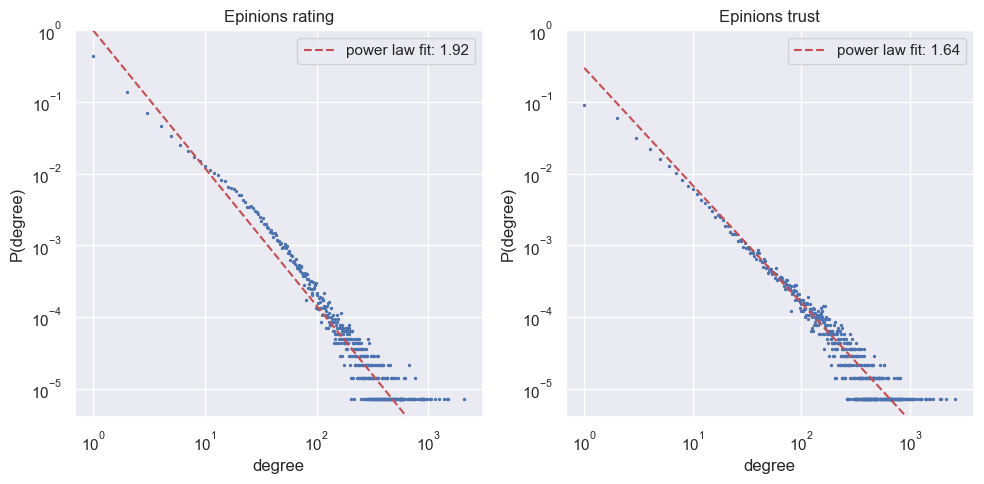
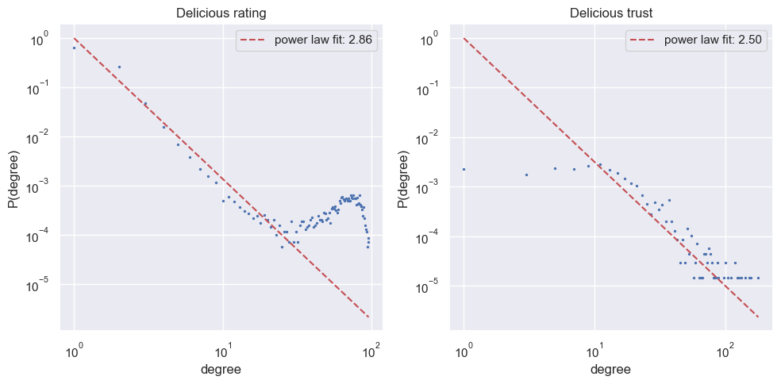

# Rapport

## Intro

### Pré-Traitement

Les données d'entrées pour les ratings sont de la forme suivante:  
| User_id | Item_id | Rating |
| :-----: |:------: | :----: |

Les données d'entrées pour les trusts sont de la forme suivante:  
| User_id | User_id | Trust |
| :------:| :-----: | :---: |

La variable Trust est un Booléen vaut 1 si l'utilisateur 1 trust l'utilisateur 2, 0 sinon

## Epinions

### Analyse descriptive

Dans cette analyse descriptive, nous allons examiner plusieurs propriétés du graphe d'un réseau social. Ce graphe représente une partie du réseau social Epinions qui est composé de sous-réseaux :

1. Les ratings (les notes données par les utilisateurs)
2. Les trusts (le niveau de confiance entre les utilisateurs)

Voici un tableau récapitulatif des propriétés du graphe d'Epinions :

| Metrique                        |       Rating        |        Trust        |
| :------------------------------ | :-----------------: | :-----------------: |
| Nombre de noeuds                |      $139738$       |       $49288$       |
| Nombre de liens                 |      $664825$       |      $487183$       |
|                                 |                     |                     |
| in-degree min                   |         $1$         |         $1$         |
| out-degree min                  |         $0$         |         $0$         |
| in-degree max                   |       $2026$        |       $2589$        |
| out-degree max                  |       $1023$        |       $1760$        |
| in-degree median                |         $1$         |         $2$         |
| out-degree median               |         $0$         |         $1$         |
| in/out-degree moyen             |       $4.76$        |       $9.88$        |
| ecart type in-degree            |       $20.02$       |       $40.10$       |
| ecart type out-degree           |       $21.29$       |       $32.85$       |
|                                 |                     |                     |
| densité                         |      $0.00002$      |       $0.004$       |
|                                 |                     |                     |
| Nombre de triangles (3-cliques) |        $153$        |       $16272$       |
| degré clique max                |         $3$         |         $3$         |
|                                 |                     |                     |
| closeness centrality min        |       $0.167$       |       $0.108$       |
| closeness centrality max        |       $0.367$       |       $0.405$       |
| closeness centrality moyen      |       $0.238$       |       $0.254$       |
| closeness centrality median     |       $0.236$       |       $0.254$       |
|                                 |                     |                     |
| betweenness centrality min      |         $0$         |         $0$         |
| betweenness centrality max      |  $1.17\times10^9$   |  $6.21\times10^7$   |
| betweenness centrality moyen    |  $1.67\times10^5$   |  $1.15\times10^5$   |
| betweenness centrality median   |         $0$         |       $19.8$        |
|                                 |                     |                     |
| PageRank min                    | $4.93\times10^{-6}$ | $4.74\times10^{-6}$ |
| PageRank max                    | $1.17\times10^{-3}$ | $3.58\times10^{-3}$ |
| PageRank moyen                  | $7.16\times10^{-6}$ | $2.03\times10^{-6}$ |
| PageRank median                 | $5.17\times10^{-6}$ | $7.01\times10^{-6}$ |
|                                 |                     |                     |
| clustering coef min             |         $0$         |         $0$         |
| clustering coef max             |         $1$         |         $1$         |
| clustering coef moyen           |      $0.0032$       |      $0.1808$       |
| clustering coef median          |         $0$         |         $0$         |

Il est aussi interessant de regarder la distribution des degrés des noeuds. Voici un histogramme des degrés des noeuds pour les ratings et les trusts :

On peut remarquer que les powerlaws s'ajustent particulièrement bien nos données.

---

Création de 2 types de configuration :

-   Une configuration avec 80% Train et 20% Test
-   Une configuration avec 90% Train et 10% Test

Ces deux configurations possèdent des hyperparamètres se rapprochant des conditions de test du rapport scientifique SocRec.

Comment ça fonctionne ?

-   Initialiser une configuration
-   Split les données en fonction du test
-   Lancer un train

## Delicious

### Analyse descriptive

Dans le même esprit que pour Epinions, nous allons examiner plusieurs propriétés du graphe du réseau social Delicious qui est composé de 3 sous-réseaux :

1. Les favoris/ratings (nombre de fois qu'un utilisateur a mis un lien en favori)
2. Les tags (les tags donnés par les utilisateurs)
3. Les trusts (le niveau de confiance entre les utilisateurs)

Dans notre cas, on cherche à prédire les favoris (ratings) et non pas les tags. On se sert alors de 2 sous-réseaux, les ratings et les trusts. Voici un tableau récapitulatif des propriétés de ces sous-réseaux de Delicious :

| Metrique                        |      Rating      |       Trust        |
| :------------------------------ | :--------------: | :----------------: |
| Nombre de noeuds                |     $69870$      |       $1861$       |
| Nombre de liens                 |     $104799$     |      $15328$       |
|                                 |                  |                    |
| in-degree min                   |       $0$        |        $1$         |
| out-degree min                  |       $0$        |        $1$         |
| in-degree max                   |       $29$       |        $90$        |
| out-degree max                  |       $95$       |        $90$        |
| in-degree median                |       $1$        |        $6$         |
| out-degree median               |       $0$        |        $6$         |
| in/out-degree moyen             |      $1.5$       |       $8.24$       |
| ecart type in-degree            |      $1.06$      |       $8.16$       |
| ecart type out-degree           |      $9.93$      |       $8.16$       |
|                                 |                  |                    |
| densité                         |    $0.00003$     |      $0.0002$      |
|                                 |                  |                    |
| Nombre de triangles (3-cliques) |     $99969$      |     $1928214$      |
| degré clique max                |       $6$        |        $6$         |
|                                 |                  |                    |
| closeness centrality min        |      $0.10$      |       $0.09$       |
| closeness centrality max        |       $1$        |        $1$         |
| closeness centrality moyen      |      $0.17$      |       $0.33$       |
| closeness centrality median     |      $0.17$      |       $0.21$       |
|                                 |                  |                    |
| betweenness centrality min      |       $0$        |        $0$         |
| betweenness centrality max      | $2.51\times10^6$ |  $1.98\times10^5$  |
| betweenness centrality moyen    | $1.48\times10^3$ |  $5.31\times10^3$  |
| betweenness centrality median   |       $0$        |       $300$        |
|                                 |                  |                    |
| PageRank min                    |  $\times10^{-}$  | $4.74\times10^{-}$ |
| PageRank max                    |  $\times10^{-}$  | $3.58\times10^{-}$ |
| PageRank moyen                  |  $\times10^{-}$  | $2.03\times10^{-}$ |
| PageRank median                 |  $\times10^{-}$  | $7.01\times10^{-}$ |
|                                 |                  |                    |
| clustering coef min             |       $0$        |        $0$         |
| clustering coef max             |       $1$        |        $1$         |
| clustering coef moyen           |    $0.00111$     |     $0.48963$      |
| clustering coef median          |       $0$        |     $0.46667$      |

Encore une fois, il est interessant de regarder la distribution des degrés des noeuds. Voici un histogramme des degrés des noeuds pour les ratings et les trusts :

Nous avons constaté que la powerlaw s'adapte efficacement aux données relatives aux trusts. Cependant, pour les ratings, cela n'est pas être le cas. Il existe un pic proche de la valeur maximale des degrés. Il est possible que cela soit dû à une tendance des utilisateurs à mettre en favoris les mêmes liens. En conséquence, l'algorithme de prédiction des favoris pourrait être plus performant que celui de prédiction des trusts, et même surpasser les résultats obtenus sur le jeu de données Epinions car il suffirait de prédire les liens les plus communs.
